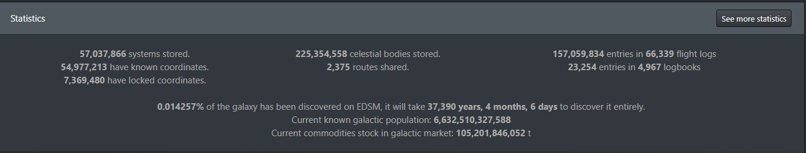
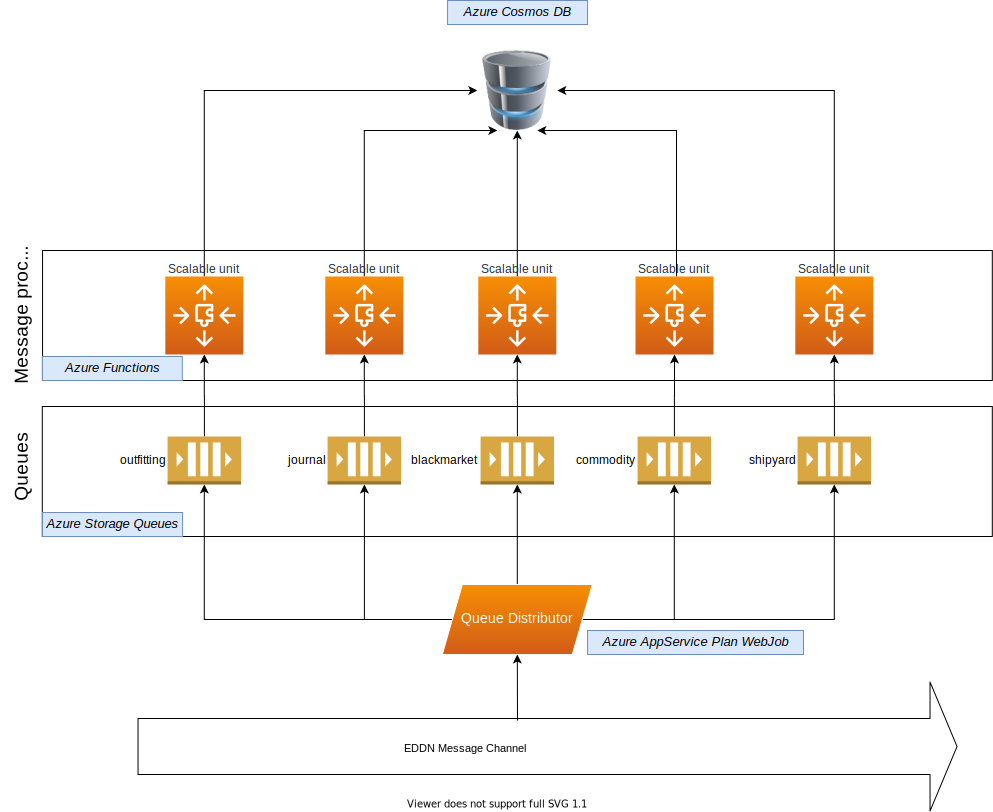

# Название
## Вступление

В элите огромная часть геймплея происходит, что бы вы не думали, в браузере, с десятком открытых вкладок. Не будем рассуждать правильно это или нет, но, определенно, в этом есть свой шарм и многим это нравится.

Происходит это по той причине, что разработчики намерянно не включают определенный функционал в игровой клиент, что значительно усложняет жизнь пилотам. Но, Frontier Development довольно отзывчивые люди и всегда идут на диалог со своими игроками. Благодаря этому у игроков появилась позможность создавать свой софт и сервисы, сильно упрощающие жизнь всем пилотам.

Что же они сделали? Спустя пару лет мытарств игроков, разработчики сделали Log-файл куда сбрасывается текущая активность пилота. А еще через пару лет они даже снабдили его документацией и поддерживают его до сих пор.

Сам файл(ы) располагаются в каталоге (на примере Windows):
> C:\Users\User Name\Saved Games\Frontier Developments\Elite Dangerous\

А документация по нему [тут](https://elite-journal.readthedocs.io/en/latest/). Она нам впоследствии сильно поможет. Т.к. я не обладаю версией клиента для PC (катаю на консоли) - все мои действия будут базироваться на этой и многих других документациях из этих ваших интернетов.

Итак, имеем файл, он мне немного не нравится, но на безрыбье и файл сойдет. Что дальше? Дальше ушлые пилоты-программисты написали кучу софта, который мониторит этот файл и делает с ним что нужно (в зависимости от конкретного софта, сохраняет данные сканов систем, планет, стоимости материалов на рынке, разведанных POI, etc). 
Вот пример тулзин которые используют командеры на своих PC:
        
    Tool	                                Commander
    E:D Market Connector	                Otis B.
    ED-Intelligent Boardcomputer Extension	Duke Jones
    edce-client	                            Andargor
    EDDI	                                VerticalBlank, Hoodathunk, T'Kael
    EDDiscovery	                            Robby
    Elite Log Agent	                        John Kozak
    Elite G19s Companion app	            MagicMau
    Elite Virtual Assistant	
    Trade Dangerous + EDAPI	                orphu

Но осталась проблема. Этой информацией надо как-то делиться. Причем так, чтобы и с тобой ей тоже делились. Дело в том, что элита это огромная игра, в ней смоделирован наш млечный путь целиком. А это значит, что там **400 миллиардов** звездных систем (систем, Карл! А в системах может быть несколько звезд и вагон планет). И игрокам понадобились инструмены позволяющие аккумулировать и анализировать информацию, собранную из лог-файла.

Тут на сцену вышли онлайн сервисы, заточенные как раз на это. Функционал многих сервисов выходит далеко за пределы возможностей предоставляемых этими логами (и это очень круто, кстати). Но нас интересует именно часть связанная с исследованиями в игре: нанес на карту новую систему, просканировал планету, узнал цены на текущей станции (ладно, торговлю тоже затронем) и т.п. Не буду тут описывать каждый детально, лишь отмечу, что самые популярные, в контексте текущего повествования, это - [EDSM](https://www.edsm.net/) и [EDDB](https://eddb.io/).

Все в этих сервисах чудесно, они буквально открывают новые горизонты при игре, за исключение одного - нет никакой возможности проводить собственную аналитику на основе их данных. И отсюда плавно переходим к обоснованию нашего проекта.
## Обоснование
До некоторых пор EDSM предоставлял полный дамп звездных тел, но буквально пару месяцев назад эта ссылка с их сайта пропала. Я уверен, что если связаться с разработчиками, то они дампом поделятся. Но, чтоб вы понимали, дамп всех извезтных им на данный момент звездных тел - это **JSON файл на 10ГБ**. Дальше этот файл надо как-то распарсить и загрузить хоть в какую-нибудь СУБД. И да, хотелось бы чтобы эта СУБД не крутилась на домашнем вечно помирающем ноуте, а работала где-то далеко и стабильно и, желательно в облаках. И не стоит забывать, что это лишь статичный одноразовый дамп! А данные постоянно обновляютсяи дополняются.


*Особенно радует строчка с % исследованных систем. Это за 6 лет существования игры. Но сейчас не об этом.*

А сейчас о том, что хотим мы тоже собирать все эти данные, но уже в свою СУБД и мутить свою статистику и репорты с обновляемыми в реалтайме данными как цари. Анализировать, находить аномалии, закономерности и вот это все!

Итак, как уже было упомянуто выше, все эти данные собирают клиентские тулзины, которые используют пека-бояре (огромное им спасибо за это, серьезно). Дальше часть из них отправляет все это на EDSM, EDDB, etc. Но главное - все они отправляют эти данные в [EDDN](https://github.com/EDCD/EDDN). Это, как я считаю, очень элегантное решение, на котором будет базироваться весь наш солюшен.

Итак, что такое EDDN и что там по архитектуре солюшена? Поехали...

## Архитектура
### Объяснение как устроена EDDN
Что такое EDDN - возьмем краткое описание из официального репозитори:
>The Elite: Dangerous Data Network is a system for willing Commanders to share dynamic data about the galaxy with others.
By pooling data in a common format, tools and analyses can be produced that add an even greater depth and vibrancy to the in-game universe.
>
>EDDN is not run by or affiliated with Frontier Developments.

По факту это общая точка входа сообщений от клиентов и ретранслятор их в общий выходной канал (чтобы все заинтересованные могли получать реалтайм обновления от всех клиентов элиты).

Точкой входа является HTTP Endpoint `https://eddn.edcd.io:4430/upload/` но он нам не интересен (он для тех кто хочет засылать туда апдейты).

Нам инересен выходной канал. Это ретранслятор на основе [ZeroMQ](https://zeromq.org/) выкидывающий входящие сообщения по адресу `tcp://eddn.edcd.io:9500`. Все клиенты подключившиеся и слушающие этот канал будут получать сообщения отправленные в точку входа.

Выглядит это примерно так (пикчер бог да):


Все что нам нужно, это подключиться к каналу. Или не все? Нет, не все. Нужно понимать, что туда сыпятся сообщения от десятков (или сотен) тысяч игроков по всему миру постоянно! И да, это еще где-то надо хранить.

### Как будет работать солюшен
Итак, в моей голове родилась следующая архитектура будущего хозяйства:

*Сразу оговорюсь - вся инфраструктура построена на базе Microsoft Azure. Выбор был сделан не на основе каких-то объективных причин и разводить холивары я тут на эту тему не хочу. Просто как факт - используем Azure, а стэком для программирования будет dotnet core/standard*

Эта схема не претендует на хайлод-серверлесс-кубернетес-автоскейл бекенд и вот это все, но для курсача в швейном колледже сгодится.

Что же тут происходит, в двух словах:

#### 1. Queue Distributor
Бэкграунд сервис который вешается на EDDN Channel сокет и ловит все сообщения появляющиеся в нем. В зависимости от типа сообщения (определяется по schemeRef проперти, но об этом, возможно, дальше) - перенаправляет его в хранилище определенной очереди. Типов сообщений в EDDN всего 5:
- https://eddn.edcd.io/schemas/journal/1
- https://eddn.edcd.io/schemas/blackmarket/1
- https://eddn.edcd.io/schemas/commodity/3
- https://eddn.edcd.io/schemas/outfitting/2
- https://eddn.edcd.io/schemas/shipyard/2

Каждое направляется в свою очередь. Зачем это сделано? Ну, кроме того что это позволяет разгрузить обработчики сообщений (о них ниже), эти сообщения еще должны обрабатываться по разному, соответственно под них нужны разные обработчики. Сейчас у меня реализованы только сообщения типа `journal`, т.к. именно там появляются данные исследований и сканов (для чего все это и затевалось с самого начала). Но, разумеется, остальные типы тоже добавлю в скором будущем.

Итак, Queue Distributor берет сообщения из EDDN и перенаправляет их в нужную очередь. Это его единственная ответственность.

#### 2. Azure Storage Queue
Собственно хранилище которое аккумлирует в себе сообщения нужного типа и откуда процессоры их забирают на обработку (которые Message Processor а не тот, что в системнике). Эта сущность предоставляется нам ажурой как сервис, так что с ней ничего делать не надо. Просто создали `Storage Account` (один на всех) и пользуем его через connection string (кто хочет, может даже Azure AD, я пока по старинке). Очередей в одном Storage Account может быть много (сколько точно - не помню, но сильно больше, чем может понадобиться).

#### 3. Message Processor
Это сущность, которая получает сообщение из определенной очереди, обрабатывает его согласно ее типу и отправляет на хранение в базу данных. Реализовано с помощь `Azure Function App`.

Честно говоря, это мой первый более-менее живой проект использующий ажурные функции и знаете что? Они офигенны =)

Начнем с того, что Azure Function это по сути WebJob (тоже термин из ажуры, если что), но более гибкий. В отличие от вебждобов, Azure Function Runtime масштабирует количество инстансов функций автоматически в зависимости от размера текущей очереди (там есть еще много факторов и способов, но сейчас только в контексте данного проекта) - много сообщений накопилось - увеличит количество инстансов, очередь пустая - уменьшит. Платите вы только за время работы функции, т.е. если нечего обрабатывать - не платите ничего.

Да, с вебджобами, можно навернуть похожую масштабируемость (Scale Out), но, насколько я знаю, на основе каких-то более строгих метрик, типа CPU/Memory consumption, etc.

Функции обладают такой неплохой фичей, как биндинги входных и выходных параметров (in/out bindings). Например, в контексте проекта, мы будем использовать входной биндинг `QueueTrigger` - в который рантайм будет мапить сообщения из очереди (и, в случае с dotnet, даже десериализовывать их во внутренние сущности). В качесте выходного биндинга мы могли бы использовать `CosmosDBTrigger` который будет мапиться на нужную коллекцию в базе. Но не будем (или будем но не всегда). Дело в том, что я начал с них, но столкнулся с проблемой намапить несколько выходных CosmosDB биндингов на разные коллекции (для случая когда сообщения из одной очереди должны попадать в разные коллекции) и так и не смог ее победить. Может я делал что-то не так, а может это и не реально сделать, но я быстро откатился до варианта: создаем свос db client и инжектим его в сервисы функции (через in-built DI, разумеется). Ладно, детали в коде, главное queue триггер есть и работает прекрасно.

>Немного полезной инфы про QueueTrigger. Когда сообщение попадает в фунцию, оно не удаляется из очереди - оно помечается как невидимое (invisible) и никакой другой клиент в очереди не сможет его прочитать. По умолчанию, время невидимости составляет 30 секунд (можно конфигурить). Если клиент явно не удалит сообщение из очереди за 30 секунд - оно станет снова доступно всем клиентам и увеличит собственный счетчик DequeueCount на 1. То же самое произойдет при возникновении исключительной ситуации в фунции (упали -> visible state on, ++DequeueCount). При DequeueCount = 5 (тоже настраивается), сообщение попадет в отдельную очередь с приставкой `-poison`. Например было сообщение из очереди `journal`, 5 раз упали на его обработке, сообщение ушло в очередь `journal-poison`. Из этой очереди потом можно найти непричастных и наказать невиновных (или как-то так). При успешном завершении функции, сообщение удаляется из очереди автоматически. Удобненько.

Ну и еще одно отличие от джобов: единицей масштабируемости WebJob является AppService. Единицей масштабируемости функции Function App. Короче - фунции чуть более легковесны, чем вебджобы и сильно дешевле оных.

У этой автоматической масштабируемости есть свои плюсы и есть свои минусы. Например: время обработки сообщения не фиксированное, может такое случиться, что придет 2 или более сообщения одной сущности. Например 2 разных пилота просканировали одну и ту же планету близко по времени, но один пилот сделал детальный скан и его сообщение содержит полную информацию о планете, а второй пилот сделал базовый скан с минимумом информации. Да, проверять перед апсертом (upsert - update || insert) состояние сущности в базе можно и, в некоторых случаях нужно, но и это еще не вся история ;-) Итак 2 пилота, сообщения разной степени детальности, приходят в нашу очередь в любом порядке. в базе этой сущности еще нету, новая планета для нас. Один инстанс функции берет полное сообщение, второй не полное. Каждый проверяет есть в базе сущность или нет, ее нет, а дальше кто последний запишет, тот и победил. Есть риск оставить в базе не полную информаци при наличии полной в очереди, именно из-за масштабируемости функций (да, кстати, CosmosDB ACID compliant).

IMHO: Бороться с этим можно, но не уверен что нужно. Борьба будет идти за счет снижения производительности. Можно например залочить коллекцию или ограничить количество инстансов функций до 1. Но, сами понимаете - оно того не стоит. При таком объеме данных (напоминаю, что мы планируем оперировать сотнями миллионов звездных систем) мы не сильно испортим статистику парочкой не полных сущностей.

Так же Cosmos DB поддерживает так называюмую [Optimistic Concurrency](https://chapsas.com/understanding-optimistic-concurrency-in-cosmos-db/), но до ее детального изучения у меня еще руки не дошли. Возможно это может быть хорошим решением. Оставлю на будущее.

#### 4. CosmosDB
Тоже сервис как есть. Ничего особого с ним делать не надо, создали через портал (да простят меня девопсеры) инстанс, получили коннекшон стринги и поехали использовать. Ну разве что коллекции я создал заранее, т.к. не хотел засорять этим делом код.

Коллекций на данный момент у меня 4: `Signals`, `Systems`, `Stations`, `Bodies`. Их количество и названия обусловлены различной информацией, которая может присутствовать в сообщении схемы `journal` (помните я говорил в начале, что файл лога мне не очень нравится? вот по-этому).

Дело в том, что одним из полей сообщений `journal` является `Event`, который может принимать следующие значения: `CarrierJump`, `Docked`, `FsdJump`, `Location`, `SaaSignalsFound`, `Scan` (это есть в документации). И, исходя из значения эвента - сообщение будет содержать принципиально разную информацию. Отсюда и такое деление: одна очередь - несколько коллекций. Чуть более детально в коде.

>Немного полезной инфы про аккаунты CosmosDB. Единицей монетизации (не уверен, можно ли так выразиться) является Request Unit per second в час - RU/s. Т.е. вы платите за RU/s в час. У них сейчас существует 2 ценовые модели: `Provisioned throughput` и `Serverless` (которая сейчас в превью, но доступна для выбора). Разница в том, что в случае с Provisioned фы фиксируете гарантированное RU/s и платите фиксированную цену (даже если база простаивает), в случае Serverless, RU/s не понятно какая, но вы платите только за использованные реквест юниты. 
>
>Так же у Provisioned модели есть возможность назначить пределы масштабируемости RU/s. Скажем, если вы назначили RU/s в 400, то при включении автоскейлинга это значение будет варьироваться от 10% до 1000% от этого значения (40-4000 RU/s)
>
>Минимальное значение RU/s в Provisioned mode - 400. После некоторых экспериментов я понял, что потребляю, в среднем, 250 RU/s и платить за лишние 150 не захотел, так что пришлось переехать на Serverless модель. 
>
>Сменить модель на живой базе нельзя, надо создавать новую (точнее целый новый аккаунт CosmosDB). Благо майкрософт услужливо предоставило утилиту для клонирования космос баз: [CosmicClone](https://github.com/microsoft/CosmicClone). Так что создал Serverless аккаунт и оперативно переехал на него. По прикидкам должно выйти чуть ли не в 2 раза дешевле. Заплатить за используемое в Provisioned Mode время, увы, все равно придется.
>
>Благодаря хранилищу очередей, переезд произошел с zero downtime для "пользователей" - я просто остановис мессадж процессоры, QueueDistributor продолжал раскидывать сообщения по очередям, в которых они и накапливались. Переместил коллекции в новую базу, поменял эндпоинты до базы в функциях и запустил их снова. Они быстренько смаштабировались в много инстансов и разгребли все очереди уже в новую базу. Старый аккаунт удалил.

Итак, на этом по архитектуре все, подведем краткий итог: из EDDN переправляем сообщения в нужную очередь, из очереди ажур функция переправляет его в нужную коллекцию в БД.
## Программирование
Как вы понимаете, никаких питонов и React Native - только dotnet, только хардкор. Распаковываем свои вижуал студии разной степени паршивости и поехали.

Сразу оставлю ссылку на репозиторий с солюшеном: [EDDNConsumer](https://github.com/ArtemKiyashko/EDDNConsumer). Извините, без ридми, без лицензии.

Разберем структуру солюшена и далее пройдемся чуть более детально по каждому проекту:
- `EDDNConsumerCore` - тот самый QueueDistributor. Читает сообщения из EDDN и отправляет их в нужную очередь
- `EDDNModels` - библиотека с моделями отражающими данные из EDDN
- `JournalContributor` - MessageProcessor для сообщений из очереди `journal`
- `SharedLibrary` - всякие хэлперы приминимые в разных проектах. На нем я останавливаться не буду.

### EDDNConsumerCore
Типичный dotnet core 3.1 консольный проект. Типично начинается с функции Main и конфигурации DI. Точкой входа в нашу бизнес логику является HostedService `ConsumerService`
```csharp
services.AddHostedService<ConsumerService>();
```

Для его работы нам потребуются следующие nuget-пакеты (помимо стандартного набора): `NetMQ` - клиентская библиотека для ZeroMq и `Ionic.Zlib` - для распаковки сообщений из NetMQ

Начинается его выполнение с метода `StartAsync`, который в моем случае не делает ничего особенного - он создает `NetMQRuntime` и запускает выполнение асинхронного делегата `ClientAsync` где и происходит чтение сообщений (приведу код полностью, он маленький):

```csharp
private async Task ClientAsync()
{
    var utf8 = new UTF8Encoding();
    using (var client = new SubscriberSocket())
    {
        client.Connect(_eddnClientSettings.ConnectionString);
        client.SubscribeToAnyTopic();
        while (true)
        {
            try
            {
                (var bytes, _) = await client.ReceiveFrameBytesAsync();
                var uncompressed = ZlibStream.UncompressBuffer(bytes);
                var result = utf8.GetString(uncompressed);
                await _messageDistributor.DistributeAsync(result);
                _logger.LogInformation(result);
            }
            catch (Exception ex)
            {
                _logger.LogError(ex, "Error reading message queue");
            }
        }
    }
}
```

Как видно, после получения сообщения (точнее фрейма, но в нашем случае все сообщение всегда помещается в 1 фрейм), мы его распаковываем и передаем в `_messageDistributor` который определит в какую очередь его запихнуть, скидываем в лог на всякий случай полученное сообщение и все, ждем новое. И так бесконечно.

Класс `MessageDistributor` и его единственный метод `DistributeAsync`:
```csharp
public async Task DistributeAsync(string message)
{
    try
    {
        using var stringReader = new StringReader(message);
        using var jsonReader = new JsonTextReader(stringReader);
        var result = _serializer.Deserialize<Entity<BaseMessage>>(jsonReader);
        var queue = await _messageQueueFactory.GetQueueAsync(result);
        await queue.SendMessageAsync(message.Base64Encode());
    }
    catch(Exception ex)
    {
        _logger.LogError(ex, "Error distributing message");
    }
}
```
как видно, сам по себе не занимается определением нужной очереди, этим занимается `MessageQueueFactory`. Ответственность дистрибьютора - взять очередь и запихнуть туда сообщение. Тут я немного слукавил и возложил на него часть отвественности фактори: десериализация части сообщения. Как я упоминал выше, определение очереди происходит на основе проперти `schemaRef` которое в объекте `header` сообщения (посмотрите ссылки на схемы выше или файл `test_data.json` из репозитория и поймете о чем я). И эту часть было бы правильней перенести в фактори, но дело в том, что я еще не определился с одной функциональностью о которой сейчас расскажу.

Как вы знаете, сериализация (сейчас и далее везде - речь о JSON) может быть очень толерантной, иногда даже слишком. И во многих языках\библиотеках\фреймворках по умолчанию, если часть сериализованного сообщения не соответствует сигнатуре класса в которое его нужно десериализовать - ничего страшного, десериализуем то что есть, остальное будет null или default. Но я имею дело с системой которая может поменять модель данных в любую секунду (сама или по воле отправителя сообщения) и, какие бы POCO классы я бы не написал, более чем вероятно, что внезапно появится новое проперти или, тупо, я какое-то забыл поместить в класс. А я очень хотел бы быть информирован об этом.

Стандартная для дотнета json-библиотека `NewtonsoftJson` имеет настройку как реагировать на такие проперти (которые есть в json, но нет в классе). Можно повесить хэндлер на `Missing Member`
```csharp
_serializer.MissingMemberHandling = MissingMemberHandling.Error;
_serializer.Error += _serializer_Error;
```
и жить препеваюче, перехватывая ошибки и логируя их в тот же `Application Insights`, настроив там Notification Alerts и прочие праздники ажуры. Но дело в том, что тогда мне тут нужно десериализовывать все сообщение, а не только `Header`. И вот с этим я пока борюсь. Я не могу поместить это на уровень ажурной фунции, т.к. там с управлением сериализацие есть некоторые проблемы, а по умолчанию сериализатор игнорирует missing property. Нет, тут нет ничего сложного, просто это моя недоделка.

Ладно, прочитали header сообщения передали его в фактори, получили очередь и записали туда сообщение. Взглянем на фактори, последняя значимаю часть этого проекта (этот класс я приведу полностью):
```csharp
public class MessageQueueFactory : IMessageQueueFactory
{
    private readonly StorageAccount _storageOptions;
    private readonly QueueMapping _queueMapping;
    private readonly IDictionary<string, QueueClient> _queues = new Dictionary<string, QueueClient>();

    public MessageQueueFactory(
        IOptions<StorageAccount> storageOptions,
        IOptions<QueueMapping> queueMapping)
    {
        _storageOptions = storageOptions.Value;
        _queueMapping = queueMapping.Value;
    }

    public async Task<QueueClient> GetQueueAsync(Entity<BaseMessage> entity)
    {
        if (_queueMapping.TryGetValue(entity.SchemaRef, out var queueName))
        {
            if (!_queues.ContainsKey(queueName))
            {
                var client = new QueueClient(_storageOptions.StorageConnectionString, queueName);
                await client.CreateIfNotExistsAsync();
                _queues.Add(queueName, client);
            }
            return _queues[queueName];
        }
        throw new ArgumentException($"Queue {entity.SchemaRef} has not configured", nameof(entity.SchemaRef));
    }
}
``` 
У нас есть некий маппинг схем сообщений на очередь, хранится он в `appsettings` json файле и для продакшена выглядит так:
```json
{
  "QueueMapping": {
    "eddn.edcd.io/schemas/journal/1": "journal"
  }
}
```
более полный в девелопе (в проде пока только журналы):
```json
"QueueMapping": {
    "eddn.edcd.io/schemas/journal/1": "journal",
    "eddn.edcd.io/schemas/blackmarket/1": "blackmarket",
    "eddn.edcd.io/schemas/commodity/3": "commodity",
    "eddn.edcd.io/schemas/outfitting/2": "outfitting",
    "eddn.edcd.io/schemas/shipyard/2": "shipyard"
  }
```

Как видно это обычный `Dictionary<string, string>` с ключем в качесте `schemaRef`. По нему достаем имя нужной нам очереди.

Далее есть еще 1 словарь `_queues` - его я сделал для хранения `QueueClient`, чтобы не создавать постоянно клиенты очередей. Не памяти экономии ради, а времени для. Посчитав, что клиенты можно спокойно переиспользовать. Потому что неизвестно какой там round trip происходит при его инициализации, вдруг он стучиться в редмонд прямо из конструктора. Да, причина возможно надумана, но не вижу повода ее игнорировать. Может я не прав, тогда поправьте.

Нучто же, если очередь ранее создана - возвращаем ее, если не создана - создаем и возвращаем. Все просто. А сверху стоит `MessageDistributor`, который уже отправит в нее сообщение.

Вот и все в этом проекте. 3 класса и ретранслятор готов. Идем дальше.
### EDDNModels
Это просто библиотека POCO классов. Вынесена в отдельный проект с целью заурядной логики, ну и просто потому что ее классы используются в нескольких проектах. Из интересного в нем только одно место, в классе `JournalMessage`:
```csharp
[JsonProperty("id")]
public override string Id
{
    get => Event switch
    {
        JournalEvent.FsdJump => StarSystem,
        JournalEvent.Scan => BodyName,
        JournalEvent.Docked => StationName,
        JournalEvent.Location => BodyName,
        JournalEvent.CarrierJump => StarSystem,
        JournalEvent.SaaSignalsFound => BodyName,
        _ => $"UnknownID_{Guid.NewGuid()}"
    };
}
```

Проперти `Id`, которое мы обязаны иметь, чтобы сохранить объект в CosmosDB. По аналогии с любой СУБД и ORM. Помните я упоминал, что в сообщения `journal` могут быть разные модели и сохраняются они в разные коллекции? Ну вот, для этого этот свитч и существует. В зависимости от `Event` выбираем какое проперти использовать в качестве `Id`. Где-то имя системы, где-то имя космического тела, а где-то имя космической станции.

Идем дальше.

### JournalContributor
Квинтэссенция масштабируемости всего решения - Azure Function App.
## Результат
## Финансовая часть
## Выводы