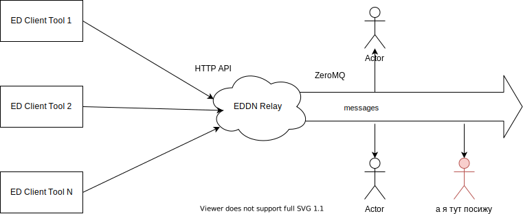

# Название
<div style="text-align:center"></div>

## Вступление

В элите огромная часть геймплея происходит, что бы вы не думали, в браузере, с десятком открытых вкладок. Не будем рассуждать правильно это или нет, но, определенно, в этом есть свой шарм и многим это нравится.

Происходит это по той причине, что разработчики намерянно не включают определенный функционал в игровой клиент, что значительно усложняет жизнь пилотам. Но, Frontier Development довольно отзывчивые люди и всегда идут на диалог со своими игроками. Благодаря этому у игроков появилась позможность создавать свой софт и сервисы, сильно упрощающие жизнь всем пилотам.

Что же они сделали? Спустя пару лет мытарств игроков, разработчики сделали Log-файл куда сбрасывается текущая активность пилота. А еще через пару лет они даже снабдили его документацией и поддерживают его до сих пор.

Сам файл(ы) располагаются в каталоге (на примере Windows):
> C:\Users\User Name\Saved Games\Frontier Developments\Elite Dangerous\

А документация по нему [тут](https://elite-journal.readthedocs.io/en/latest/). Она нам впоследствии сильно поможет. Т.к. я не обладаю версией клиента для PC (катаю на консоли) - все мои действия будут базироваться на этой и многих других документациях из этих ваших интернетов.

Итак, имеем файл, он мне немного не нравится, но на безрыбье и файл сойдет. Что дальше? Дальше ушлые пилоты-программисты написали кучу софта, который мониторит этот файл и делает с ним что нужно (в зависимости от конкретного софта, сохраняет данные сканов систем, планет, стоимости материалов на рынке, разведанных POI, etc). 
Вот пример тулзин которые используют командеры на своих PC:
        
| Tool | Commander |
| ---- | --------- |
| E:D Market Connector | Otis B.|
| ED-Intelligent Boardcomputer Extension | Duke Jones |
| edce-client | Andargor |
| EDDI |VerticalBlank, Hoodathunk, T'Kael |
| EDDiscovery | Robby |
| Elite Log Agent | John Kozak |
| Elite G19s Companion app | MagicMau |
| Elite Virtual Assistant | |
| Trade Dangerous + EDAPI | orphu |

Но осталась проблема. Этой информацией надо как-то делиться. Причем так, чтобы и с тобой ей тоже делились. Дело в том, что элита это огромная игра, в ней смоделирован наш млечный путь целиком. А это значит, что там **400 миллиардов** звездных систем (систем, Карл! А в системах может быть несколько звезд и вагон планет). И игрокам понадобились инструмены позволяющие аккумулировать и анализировать информацию, собранную из лог-файла.

Тут на сцену вышли онлайн сервисы, заточенные как раз на это. Функционал многих сервисов выходит далеко за пределы возможностей предоставляемых этими логами (и это очень круто, кстати). Но нас интересует именно часть связанная с исследованиями в игре: нанес на карту новую систему, просканировал планету, узнал цены на текущей станции (ладно, торговлю тоже затронем) и т.п. Не буду тут описывать каждый детально, лишь отмечу, что самые популярные, в контексте текущего повествования, это - [EDSM](https://www.edsm.net/) и [EDDB](https://eddb.io/).

Все в этих сервисах чудесно, они буквально открывают новые горизонты при игре, за исключение одного - нет никакой возможности проводить собственную аналитику на основе их данных. И отсюда плавно переходим к обоснованию нашего проекта.
## Обоснование
До некоторых пор EDSM предоставлял полный дамп звездных тел, но буквально пару месяцев назад эта ссылка с их сайта пропала. Я уверен, что если связаться с разработчиками, то они дампом поделятся. Но, чтоб вы понимали, дамп всех извезтных им на данный момент звездных тел - это **JSON файл на 10ГБ**. Дальше этот файл надо как-то распарсить и загрузить хоть в какую-нибудь СУБД. И да, хотелось бы чтобы эта СУБД не крутилась на домашнем вечно помирающем ноуте, а работала где-то далеко и стабильно и, желательно в облаках. И не стоит забывать, что это лишь статичный одноразовый дамп! А данные постоянно обновляютсяи дополняются.
<div style="text-align:center"></div>

*Особенно радует строчка с % исследованных систем. Это за 6 лет существования игры. Но сейчас не об этом.*

А сейчас о том, что хотим мы тоже собирать все эти данные, но уже в свою СУБД и мутить свою статистику и репорты с обновляемыми в реалтайме данными как цари. Анализировать, находить аномалии, закономерности и вот это все!

Итак, как уже было упомянуто выше, все эти данные собирают клиентские тулзины, которые используют пека-бояре (огромное им спасибо за это, серьезно). Дальше часть из них отправляет все это на EDSM, EDDB, etc. Но главное - все они отправляют эти данные в [EDDN](https://github.com/EDCD/EDDN). Это, как я считаю, очень элегантное решение, на котором будет базироваться весь наш солюшен.

Итак, что такое EDDN и что там по архитектуре солюшена? Поехали...

## Архитектура
### Объяснение как устроена EDDN
Что такое EDDN - возьмем краткое описание из официального репозитори:
>The Elite: Dangerous Data Network is a system for willing Commanders to share dynamic data about the galaxy with others.
By pooling data in a common format, tools and analyses can be produced that add an even greater depth and vibrancy to the in-game universe.
>
>EDDN is not run by or affiliated with Frontier Developments.

По факту это общая точка входа сообщений от клиентов и ретранслятор их в общий выходной канал (чтобы все заинтересованные могли получать реалтайм обновления от всех клиентов элиты).

Точкой входа является HTTP Endpoint `https://eddn.edcd.io:4430/upload/` но он нам не интересен (он для тех кто хочет засылать туда апдейты).

Нам инересен выходной канал. Это ретранслятор на основе [ZeroMQ](https://zeromq.org/) выкидывающий входящие сообщения по адресу `tcp://eddn.edcd.io:9500`. Все клиенты подключившиеся и слушающие этот канал будут получать сообщения отправленные в точку входа.

Выглядит это примерно так (пикчер бог да):
<div style="text-align:center"></div>

Все что нам нужно, это подключиться к каналу. Или не все? Нет, не все. Нужно понимать, что туда сыпятся сообщения от десятков (или сотен) тысяч игроков по всему миру постоянно! И да, это еще где-то надо хранить.

### Как будет работать солюшен
Итак, в моей голове родилась следующая архитектура будущего хозяйства:
<div style="text-align:center"></div>

*Сразу оговорюсь - вся инфраструктура построена на базе Microsoft Azure. Выбор был сделан не на основе каких-то объективных причин и разводить холивары я тут на эту тему не хочу. Просто как факт - используем Azure, а стэком для программирования будет dotnet core/standard*

Эта схема не претендует на хайлод-серверлесс-кубернетес-автоскейл бекенд и вот это все, но для курсача в швейном колледже сгодится.

Что же тут происходит, в двух словах:

#### 1. Message Distributor
Бэкграунд сервис который вешается на EDDN Channel сокет и ловит все сообщения появляющиеся в нем. В зависимости от типа сообщения (определяется по schemeRef проперти, но об этом дальше) - перенаправляет его в хранилище определенной очереди. Типов сообщений в EDDN всего 5:
- https://eddn.edcd.io/schemas/journal/1
- https://eddn.edcd.io/schemas/blackmarket/1
- https://eddn.edcd.io/schemas/commodity/3
- https://eddn.edcd.io/schemas/outfitting/2
- https://eddn.edcd.io/schemas/shipyard/2

Каждое направляется в свою очередь. Зачем это сделано? Ну, кроме того что это позволяет разгрузить обработчики сообщений (о них ниже), эти сообщения еще должны обрабатываться по разному, соответственно под них нужны разные обработчики. Сейчас у меня реализованы только сообщения типа `journal`, т.к. именно там появляются данные исследований и сканов (для чего все это и затевалось с самого начала). Но, разумеется, остальные типы тоже добавлю в скором будущем.

Итак, Queue Distributor берет сообщения из EDDN и перенаправляет их в нужную очередь. Это его единственная ответственность.

#### 2. Azure Storage Queue
Собственно хранилище которое аккумлирует в себе сообщения нужного типа и откуда процессоры их забирают на обработку (которые Message Processor а не тот, что в системнике). Эта сущность предоставляется нам ажурой как сервис, так что с ней ничего делать не надо. Просто создали `Storage Account` (один на всех) и пользуем его через connection string (кто хочет, может даже Azure AD, я пока по старинке). Очередей в одном Storage Account может быть много (сколько точно - не помню, но сильно больше, чем может понадобиться).
>Для разработки и локальной отладки может пригодиться [Azure Storage Emulator](https://docs.microsoft.com/en-us/azure/storage/common/storage-use-emulator) и [Azure Storage Explorer](https://azure.microsoft.com/en-us/features/storage-explorer/)

#### 3. Message Processor
Это сущность, которая получает сообщение из определенной очереди, обрабатывает его согласно ее типу и отправляет на хранение в базу данных. Реализовано с помощь `Azure Function App`.

Честно говоря, это мой первый более-менее живой проект использующий ажурные функции и знаете что? Они офигенны =)

Начнем с того, что Azure Function это по сути WebJob (тоже термин из ажуры, если что), но более гибкий. В отличие от вебждобов, Azure Function Runtime масштабирует количество инстансов функций автоматически в зависимости от размера текущей очереди (там есть еще много факторов и способов, но сейчас только в контексте данного проекта) - много сообщений накопилось - увеличит количество инстансов, очередь пустая - уменьшит. Платите вы только за время работы функции, т.е. если нечего обрабатывать - не платите ничего.

Да, с вебджобами, можно навернуть похожую масштабируемость (Scale Out), но, насколько я знаю, на основе каких-то более строгих метрик, типа CPU/Memory consumption, etc.

Функции обладают такой неплохой фичей, как биндинги входных и выходных параметров (in/out bindings). Например, в контексте проекта, мы будем использовать входной биндинг `QueueTrigger` - в который рантайм будет мапить сообщения из очереди (и, в случае с dotnet, даже десериализовывать их во внутренние сущности). В качесте выходного биндинга мы могли бы использовать `CosmosDBTrigger` который будет мапиться на нужную коллекцию в базе. Но не будем (или будем но не всегда). Дело в том, что я начал с них, но столкнулся с проблемой намапить несколько выходных CosmosDB биндингов на разные коллекции (для случая когда сообщения из одной очереди должны попадать в разные коллекции) и так и не смог ее победить. Может я делал что-то не так, а может это и не реально сделать, но я быстро откатился до варианта: создаем свос db client и инжектим его в сервисы функции (через in-built DI, разумеется). Ладно, детали в коде, главное queue триггер есть и работает прекрасно.

>Немного полезной инфы про QueueTrigger. Когда сообщение попадает в фунцию, оно не удаляется из очереди - оно помечается как невидимое (invisible) и никакой другой клиент в очереди не сможет его прочитать. По умолчанию, время невидимости составляет 30 секунд (можно конфигурить). Если клиент явно не удалит сообщение из очереди за 30 секунд - оно станет снова доступно всем клиентам и увеличит собственный счетчик DequeueCount на 1. То же самое произойдет при возникновении исключительной ситуации в фунции (упали -> visible state on, ++DequeueCount). При DequeueCount = 5 (тоже настраивается), сообщение попадет в отдельную очередь с приставкой `-poison`. Например было сообщение из очереди `journal`, 5 раз упали на его обработке, сообщение ушло в очередь `journal-poison`. Из этой очереди потом можно найти непричастных и наказать невиновных (или как-то так). При успешном завершении функции, сообщение удаляется из очереди автоматически. Удобненько.

Ну и еще одно отличие от джобов: единицей масштабируемости WebJob является AppService. Единицей масштабируемости функции Function App. Короче - фунции чуть более легковесны, чем вебджобы и сильно дешевле оных.

У этой автоматической масштабируемости есть свои плюсы и есть свои минусы. Например: время обработки сообщения не фиксированное, может такое случиться, что придет 2 или более сообщения одной сущности. Например 2 разных пилота просканировали одну и ту же планету близко по времени, но один пилот сделал детальный скан и его сообщение содержит полную информацию о планете, а второй пилот сделал базовый скан с минимумом информации. Да, проверять перед апсертом (upsert - update || insert) состояние сущности в базе можно и, в некоторых случаях нужно, но и это еще не вся история ;-) Итак 2 пилота, сообщения разной степени детальности, приходят в нашу очередь в любом порядке. в базе этой сущности еще нету, новая планета для нас. Один инстанс функции берет полное сообщение, второй не полное. Каждый проверяет есть в базе сущность или нет, ее нет, а дальше кто последний запишет, тот и победил. Есть риск оставить в базе не полную информаци при наличии полной в очереди, именно из-за масштабируемости функций (да, кстати, CosmosDB ACID compliant).

IMHO: Бороться с этим можно, но не уверен что нужно. Борьба будет идти за счет снижения производительности. Можно например залочить коллекцию или ограничить количество инстансов функций до 1. Но, сами понимаете - оно того не стоит. При таком объеме данных (напоминаю, что мы планируем оперировать сотнями миллионов звездных систем) мы не сильно испортим статистику парочкой не полных сущностей.

Так же Cosmos DB поддерживает так называюмую [Optimistic Concurrency](https://chapsas.com/understanding-optimistic-concurrency-in-cosmos-db/), но до ее детального изучения у меня еще руки не дошли. Возможно это может быть хорошим решением. Оставлю на будущее.

#### 4. CosmosDB
Тоже сервис как есть. Ничего особого с ним делать не надо, создали через портал (да простят меня девопсеры) инстанс, получили коннекшон стринги и поехали использовать. Ну разве что коллекции я создал заранее, т.к. не хотел засорять этим делом код.

Коллекций на данный момент у меня 4: `Signals`, `Systems`, `Stations`, `Bodies`. Их количество и названия обусловлены различной информацией, которая может присутствовать в сообщении схемы `journal` (помните я говорил в начале, что файл лога мне не очень нравится? вот по-этому).

Дело в том, что одним из полей сообщений `journal` является `Event`, который может принимать следующие значения: `CarrierJump`, `Docked`, `FsdJump`, `Location`, `SaaSignalsFound`, `Scan` (это есть в документации). И, исходя из значения эвента - сообщение будет содержать принципиально разную информацию. Отсюда и такое деление: одна очередь - несколько коллекций. Чуть более детально в коде.

>Немного полезной инфы про аккаунты CosmosDB. Единицей монетизации (не уверен, можно ли так выразиться) является Request Unit per second в час - RU/s. Т.е. вы платите за RU/s в час. У них сейчас существует 2 ценовые модели: `Provisioned throughput` и `Serverless` (которая сейчас в превью, но доступна для выбора). Разница в том, что в случае с Provisioned фы фиксируете гарантированное RU/s и платите фиксированную цену (даже если база простаивает), в случае Serverless, RU/s такая, какую вы сгенерируете, но вы платите только за использованные реквест юниты. 
>
>Так же у Provisioned модели есть возможность назначить пределы масштабируемости RU/s. Скажем, если вы назначили RU/s в 400, то при включении автоскейлинга это значение будет варьироваться от 10% до 1000% от этого значения (40-4000 RU/s)
>
>Минимальное значение RU/s в Provisioned mode - 400. После некоторых экспериментов я понял, что потребляю, в среднем, 250 RU/s и платить за лишние 150 не захотел, так что пришлось переехать на Serverless модель. 
>
>Сменить модель на живой базе нельзя, надо создавать новую (точнее целый новый аккаунт CosmosDB). Благо майкрософт услужливо предоставило утилиту для клонирования космос баз: [CosmicClone](https://github.com/microsoft/CosmicClone). Так что создал Serverless аккаунт и оперативно переехал на него. По прикидкам должно выйти чуть ли не в 2 раза дешевле. Заплатить за используемое в Provisioned Mode время, увы, все равно придется.
>
>Благодаря хранилищу очередей, переезд произошел с zero downtime для "пользователей" - я просто остановис мессадж процессоры, QueueDistributor продолжал раскидывать сообщения по очередям, в которых они и накапливались. Переместил коллекции в новую базу, поменял эндпоинты до базы в функциях и запустил их снова. Они быстренько смаштабировались в много инстансов и разгребли все очереди уже в новую базу. Старый аккаунт удалил.
>
>В ходе разработки и локальной отладки вам пригодится [эмулятор CosmosDB](https://docs.microsoft.com/pl-pl/azure/cosmos-db/local-emulator?tabs=cli%2Cssl-netstd21)

Итак, на этом по архитектуре все, подведем краткий итог: из EDDN переправляем сообщения в нужную очередь, из очереди ажур функция переправляет его в нужную коллекцию в БД.
## Программирование
Как вы понимаете, никаких питонов и React Native - только dotnet, только хардкор. Распаковываем свои вижуал студии разной степени паршивости и поехали.

Сразу оставлю ссылку на репозиторий с солюшеном: [EDDNConsumer](https://github.com/ArtemKiyashko/EDDNConsumer). Извините, без ридми, без лицензии.

Разберем структуру солюшена и далее пройдемся чуть более детально по каждому проекту:
- `EDDNConsumerCore` - тот самый QueueDistributor. Читает сообщения из EDDN и отправляет их в нужную очередь
- `EDDNModels` - библиотека с моделями отражающими данные из EDDN
- `JournalContributor` - MessageProcessor для сообщений из очереди `journal`
- `SharedLibrary` - всякие хэлперы приминимые в разных проектах. На нем я останавливаться не буду.

### EDDNConsumerCore
Типичный dotnet core 3.1 консольный проект. Типично начинается с функции Main и конфигурации DI. Точкой входа в нашу бизнес логику является HostedService `ConsumerService`
```csharp
services.AddHostedService<ConsumerService>();
```

Для его работы нам потребуются следующие nuget-пакеты (помимо стандартного набора): `NetMQ` - клиентская библиотека для ZeroMq и `Ionic.Zlib` - для распаковки сообщений из NetMQ

Начинается его выполнение с метода `StartAsync`, который в моем случае не делает ничего особенного - он создает `NetMQRuntime` и запускает выполнение асинхронного делегата `ClientAsync` где и происходит чтение сообщений (приведу код полностью, он маленький):

```csharp
private async Task ClientAsync()
{
    var utf8 = new UTF8Encoding();
    using (var client = new SubscriberSocket())
    {
        client.Connect(_eddnClientSettings.ConnectionString);
        client.SubscribeToAnyTopic();
        while (true)
        {
            try
            {
                (var bytes, _) = await client.ReceiveFrameBytesAsync();
                var uncompressed = ZlibStream.UncompressBuffer(bytes);
                var result = utf8.GetString(uncompressed);
                await _messageDistributor.DistributeAsync(result);
                _logger.LogInformation(result);
            }
            catch (Exception ex)
            {
                _logger.LogError(ex, "Error reading message queue");
            }
        }
    }
}
```

Как видно, после получения сообщения (точнее фрейма, но в нашем случае все сообщение всегда помещается в 1 фрейм), мы его распаковываем и передаем в `_messageDistributor` который определит в какую очередь его запихнуть, скидываем в лог на всякий случай полученное сообщение и все, ждем новое. И так бесконечно.

Класс `MessageDistributor` и его единственный метод `DistributeAsync`:
```csharp
public async Task DistributeAsync(string message)
{
    try
    {
        using var stringReader = new StringReader(message);
        using var jsonReader = new JsonTextReader(stringReader);
        var result = _serializer.Deserialize<Entity<BaseMessage>>(jsonReader);
        var queue = await _messageQueueFactory.GetQueueAsync(result);
        await queue.SendMessageAsync(message.Base64Encode());
    }
    catch(Exception ex)
    {
        _logger.LogError(ex, "Error distributing message");
    }
}
```
как видно, сам по себе не занимается определением нужной очереди, этим занимается `MessageQueueFactory`. Ответственность дистрибьютора - взять очередь и запихнуть туда сообщение. Тут я немного слукавил и возложил на него часть отвественности фактори: десериализация части сообщения. Как я упоминал выше, определение очереди происходит на основе проперти `schemaRef` которое в объекте `header` сообщения (посмотрите ссылки на схемы выше или файл `test_data.json` из репозитория и поймете о чем я). И эту часть было бы правильней перенести в фактори, но дело в том, что я еще не определился с одной функциональностью о которой сейчас расскажу.

Как вы знаете, сериализация (сейчас и далее везде - речь о JSON) может быть очень толерантной, иногда даже слишком. И во многих языках\библиотеках\фреймворках по умолчанию, если часть сериализованного сообщения не соответствует сигнатуре класса в которое его нужно десериализовать - ничего страшного, десериализуем то что есть, остальное будет null или default. Но я имею дело с системой которая может поменять модель данных в любую секунду (сама или по воле отправителя сообщения) и, какие бы POCO классы я бы не написал, более чем вероятно, что внезапно появится новое проперти или, тупо, я какое-то забыл поместить в класс. А я очень хотел бы быть информирован об этом.

Стандартная для дотнета json-библиотека `NewtonsoftJson` имеет настройку как реагировать на такие проперти (которые есть в json, но нет в классе). Можно повесить хэндлер на `Missing Member`
```csharp
_serializer.MissingMemberHandling = MissingMemberHandling.Error;
_serializer.Error += _serializer_Error;
```
и жить препеваюче, перехватывая ошибки и логируя их в тот же `Application Insights`, настроив там Notification Alerts и прочие праздники ажуры. Но дело в том, что тогда мне тут нужно десериализовывать все сообщение, а не только `Header`. И вот с этим я пока борюсь. Я не могу поместить это на уровень ажурной фунции, т.к. там с управлением сериализацие есть некоторые проблемы, а по умолчанию сериализатор игнорирует missing property. Нет, тут нет ничего сложного, просто это моя недоделка.

Ладно, прочитали header сообщения передали его в фактори, получили очередь и записали туда сообщение. Взглянем на фактори, последняя значимая часть этого проекта (этот класс я приведу полностью):
```csharp
public class MessageQueueFactory : IMessageQueueFactory
{
    private readonly StorageAccount _storageOptions;
    private readonly QueueMapping _queueMapping;
    private readonly IDictionary<string, QueueClient> _queues = new Dictionary<string, QueueClient>();

    public MessageQueueFactory(
        IOptions<StorageAccount> storageOptions,
        IOptions<QueueMapping> queueMapping)
    {
        _storageOptions = storageOptions.Value;
        _queueMapping = queueMapping.Value;
    }

    public async Task<QueueClient> GetQueueAsync(Entity<BaseMessage> entity)
    {
        if (_queueMapping.TryGetValue(entity.SchemaRef, out var queueName))
        {
            if (!_queues.ContainsKey(queueName))
            {
                var client = new QueueClient(_storageOptions.StorageConnectionString, queueName);
                await client.CreateIfNotExistsAsync();
                _queues.Add(queueName, client);
            }
            return _queues[queueName];
        }
        throw new ArgumentException($"Queue {entity.SchemaRef} has not configured", nameof(entity.SchemaRef));
    }
}
``` 
У нас есть некий маппинг схем сообщений на очередь, хранится он в `appsettings` json файле и для продакшена выглядит так:
```json
{
  "QueueMapping": {
    "eddn.edcd.io/schemas/journal/1": "journal"
  }
}
```
более полный в девелопе (в проде пока только журналы):
```json
"QueueMapping": {
    "eddn.edcd.io/schemas/journal/1": "journal",
    "eddn.edcd.io/schemas/blackmarket/1": "blackmarket",
    "eddn.edcd.io/schemas/commodity/3": "commodity",
    "eddn.edcd.io/schemas/outfitting/2": "outfitting",
    "eddn.edcd.io/schemas/shipyard/2": "shipyard"
  }
```

Как видно это обычный `Dictionary<string, string>` с ключем в качестве `schemaRef`. По нему достаем имя нужной нам очереди.

Далее есть еще 1 словарь `_queues` - его я сделал для хранения `QueueClient`, чтобы не создавать постоянно клиенты очередей. Не памяти экономии ради, а времени для. Посчитав, что клиенты можно спокойно переиспользовать. Потому что неизвестно какой там round trip происходит при его инициализации, вдруг он стучится в редмонд прямо из конструктора. Да, причина возможно надумана, но не вижу повода ее игнорировать. Может я не прав, тогда поправьте.

Ну что же, если очередь ранее создана - возвращаем ее, если не создана - создаем и возвращаем. Все просто. А сверху стоит `MessageDistributor`, который уже отправит в нее сообщение.

Вот и все в этом проекте. 3 класса и ретранслятор готов. Идем дальше.
### EDDNModels
Это просто библиотека POCO классов. Вынесена в отдельный проект с целью заурядной логики, ну и просто потому что ее классы используются в нескольких проектах. Из интересного в нем только одно место, в классе `JournalMessage`:
```csharp
[JsonProperty("id")]
public override string Id
{
    get => Event switch
    {
        JournalEvent.FsdJump => StarSystem,
        JournalEvent.Scan => BodyName,
        JournalEvent.Docked => StationName,
        JournalEvent.Location => BodyName,
        JournalEvent.CarrierJump => StarSystem,
        JournalEvent.SaaSignalsFound => BodyName,
        _ => $"UnknownID_{Guid.NewGuid()}"
    };
}
```

Проперти `Id`, которое мы обязаны иметь, чтобы сохранить объект в CosmosDB. По аналогии с любой СУБД и ORM. Помните я упоминал, что в сообщения `journal` могут быть разные модели и сохраняются они в разные коллекции? Ну вот, для этого этот свитч и существует. В зависимости от `Event` выбираем какое проперти использовать в качестве `Id`. Где-то имя системы, где-то имя космического тела, а где-то имя космической станции.

Информация передаваемая об объектах может быть самая разная. Для небесных тел это: гравитация, наклон оси, период обращения, радиус, масса, класс светимости, возраст, расстояние до звезды, наличие и состав колец, годится\не годится для посадки и т.п. (полный список можно посмотреть в классе `JournalMessage`). Для станций передается их тип, список услуг, главенствующая фракция и т.д. В общем это POCO - и они понятны даже ежу.

Идем дальше.

### JournalContributor
Наш "разгребатель" очереди `journal` - Azure Function App. Сам Function App это классическая dotnet core class library и может содерждать в себе несколько, собственно, функций. Метод функции помечается аттрибутом `FunctionName` через который может даже немного настраиваться. В этом проекте я использовал подход: одна задача - один Function App (с одной функцией). Все из-за единицы масштабируемости - приложение. Мне не было смысла пихать все мессадж процессоры в одно приложение, так как рантайм будет масштабировать все приложение целиком. А хотелось побольше гибкости. К тому же, функции настолько дешевые, что это вполне нам по карману (об этом в финансовой части).

Итак, у нас есть функция:
```csharp
public class JournalContributor
    {
        private readonly IEventTypeProcessorFactory _eventTypeProcessorFactory;

        public JournalContributor(IEventTypeProcessorFactory eventTypeProcessorFactory)
        {
            _eventTypeProcessorFactory = eventTypeProcessorFactory;
        }

        [FunctionName("ContributeJournal")]
        public async Task Run(
            [QueueTrigger("journal", Connection = "AzureWebJobsStorage")]
            Entity<JournalMessage> myQueueItem,
            ILogger log)
        {
            try
            {
                var eventProcessor = _eventTypeProcessorFactory.GetProcessor(myQueueItem.Message);
                await eventProcessor.ProcessEventAsync(myQueueItem.Message);
            }
            catch(Exception ex)
            {
                log.LogError(ex, $"Error processing queue item: {JsonConvert.SerializeObject(myQueueItem)}");
                throw;
            }
        }
    }
```

С входящим биндингом `QueueTrigger` в который рантайм передает нам сообщения из очереди (если они есть). Далее, по типу `Event` мы получаем конкретный обработчик для этого сообщения и... обрабатываем его.

Здесь, на самом деле, хочу остановиться только на конструкторе. Все дело во внедрении зависимости - оно не совсем такое, каким мы его привыкли видеть в большинстве dotnet приложений. Есть привычный нам класс `Startup` и даже метод `Configure`, но стартап должен наследовать класс `FunctionStartup` и должна быть указана сборка (`assembly`):
```csharp
using JournalContributor.Settings;
using Microsoft.Extensions.Configuration;
using System.IO;

[assembly: FunctionsStartup(typeof(JournalContributor.Startup))]

namespace JournalContributor
{
    public class Startup : FunctionsStartup
    {
        private IConfigurationRoot _functionConfig;
        private readonly string COSMOS_CONNECTION_STRING = Environment.GetEnvironmentVariable("CosmosDBConnectionString");
        private readonly string ENVIRONMENT = Environment.GetEnvironmentVariable("ASPNETCORE_ENVIRONMENT");

        public override void Configure(IFunctionsHostBuilder builder)
        {
            _functionConfig = new ConfigurationBuilder()
                .AddJsonFile(Path.Combine(builder.GetContext().ApplicationRootPath, "appsettings.json"), optional: true, reloadOnChange: true)
                .AddJsonFile(Path.Combine(builder.GetContext().ApplicationRootPath, $"appsettings.{ENVIRONMENT}.json"), optional: true, reloadOnChange: true)
                .Build();

            builder.Services.AddSingleton<CosmosClient>(factory => new CosmosClient(COSMOS_CONNECTION_STRING));
            builder.Services.AddSingleton<IEventTypeProcessorFactory, EventTypeProcessorFactory>();
            builder.Services.AddTransient<FsdJumpProcessor>();
            builder.Services.AddTransient<ScanProcessor>();
            builder.Services.AddTransient<DockedProcessor>();
            builder.Services.AddTransient<LocationProcessor>();
            builder.Services.AddTransient<SaaSignalsFoundProcessor>();
            builder.Services.Configure<CosmosDbSettings>(_functionConfig.GetSection("CosmosDbSettings"));
        }
    }
}
```
Ну а дальше DI настраивается вполне привычно и думаю пояснений не требует. Хочу еще напомнить, почему родилась зависимость от `CosmosClient` в конструкторе функции: у меня не получилось внедрить несколько однотипных биндингов (`CosmosDB`). Разных? Пожалуйста. А вот 2 и более выходных биндинга на разные коллекции в `CosmosDB` - увы, не смог. У кого получится, просьба поделиться.

Вернемся к функции. Там, разумеется есть фактори, которая есть просто `switch` с порождением нужного процессора:
```csharp
public IEventTypeProcessor GetProcessor(JournalMessage journalMessage) => journalMessage.Event switch
        {
            JournalEvent.FsdJump => _serviceProvider.GetService<FsdJumpProcessor>(),
            JournalEvent.Scan => _serviceProvider.GetService<ScanProcessor>(),
            JournalEvent.Docked => _serviceProvider.GetService<DockedProcessor>(),
            JournalEvent.Location => _serviceProvider.GetService<LocationProcessor>(),
            JournalEvent.SaaSignalsFound => _serviceProvider.GetService<SaaSignalsFoundProcessor>(),
            JournalEvent.CarrierJump => _serviceProvider.GetService<DockedProcessor>(),
            _ => throw new ArgumentException($"Unknown Event {journalMessage.Event}", nameof(journalMessage.Event))
        };
```
Все процессоры перебирать не будем, кому интересно, загляните в репу. Быстренько поясню только `ScanProcessor`, т.к. он единственный содержит больше 2-х строк:
```csharp
public async Task ProcessEventAsync(JournalMessage message)
        {
            var existingItem = await message.CheckIfItemExists(_bodiesContainer, _options.BodiesCollection.PartitionKey);
            if (existingItem == null)
                await _bodiesContainer.UpsertItemAsync(message);
            else
            {
                //Basic scan type contains less information then others.
                //We`re skipping item upsert if remote item has scan type higher then Basic
                //We`re also skippings if remote item scan type is Detailed (as it`s a maximum info scan)
                //Will update item if both (remote and current) have scan type Basic
                //And will upsert item in case of current item have higher scan type then remote
                if ((message.ScanType == ScanType.Basic && existingItem.ScanType != ScanType.Basic) ||
                    existingItem.ScanType == ScanType.Detailed)
                    return;
                else
                    await _bodiesContainer.UpsertItemAsync(message);
            }
        }
```
Я не являюсь большим фанатом комментариев в коде, так как чаще всего это не отражает квалификацию программиста, а наоборот, означает, что этот код настолько плох, что требует пояснений. Ну вот и тут решил эти пояснения оставить. Я вскользь упоминал про эту проблему с разной детализацией сканов выше и вот мой ответ на нее. Он не идеален, но пока другого у меня нет. Буквально, тут происходит следущее: мы проверяем, есть ли в контейнере `Bodies` сущность с таким же `Id` который нам приехал из очереди. Если нет, то сохраняем свою.
>Тут мне пришлось использовать именно UpSert, а не Insert, т.к. с инсертом я получал concurrency и вылезали ошибки: Item with such Id already exists (или как-то так). Думаю тот подход, упомянутый выше, с `Optimistic Concurrency` как раз бы решил эту проблему. Так что закинем эту мысль в беклог и вернемся потом. Пока upsert.

Если такая сущность в контейнере есть, то разбираемся что там по `ScanType`. `Detailed` - самый подробный тип и нам нет смысла его обновлять. `Basic` - самый малоинформативный - и его можно обновить всегда. Если в контейнере `Basic` - просто апсертим новое сообщение и не паримся. В этом вся логика.

Вот и вся функция. Тоже, фактически 3 класса, никакой магии и `MessageProcessor` для `journal` готов.
## Результат
Настало время посмотреть, что же у нас получилось. Напоминаю, что писали мы `Azure WebJob` для распределения сообщений из EDDN по очередям, создали `Storage Account` для хранения этих очередей, написали `Azure Function App` для обработки одного из типов сообщений из очереди и создали `Cosmos DB` аккаунт для хранения результатов. Так же я сбоку навернул `Application Insights` везде где только смог для мониторинга ситуации (и, сюрприз-сюрприз, это выстрелило мне в ногу по цене, но об этом в финансовой части). Ну что, задеплоили этот велосипед и давайте посмотрим что все работает.

<div style="text-align:center"></div>

Наш вебджоб запущен в режиме `continuous`, т.к. должен постоянно прослушивать сокет и тягать оттуда сообщения.

<div style="text-align:center"></div>

Из ошибок только наши исключения, сообщающие о том, что не для всех `schemaRef` у нас еще есть очереди. Это нормально, других ошибок нет.

<div style="text-align:center"></div>

Stream-log нашей функции: реквесты идут, ошибок нет, среднее время обработки сообщения... более чем меня устраивает.

<div style="text-align:center"></div>

количество запусков функции за последний час. Неплохо, малыш, неплохо ;-)

<div style="text-align:center"></div>

Среднее потребление RU/s в нашей базе за последний час. Как видно - все еще выгодней чем `Provisioned Mode` с их минимальным 400 RU/s.

<div style="text-align:center"></div>

Заглянем в космос. За время написания статьи накопилось 145к звездных систем. Это крохи по сравнению с такими гигантами как EDSM, но и мы всего пару дней как открылись =)

<div style="text-align:center"></div>

Последнее добавленное в базу небесное тело. Check.

Хватит наверное скриншотов. Все подсистемы запущены и работают штатно. Пора разобраться сколько нам это все будет стоить.
## Финансовая часть
Моя не любимая. Давайте сразу обозначим допустимы бюджет. Так как именно из-за бюджетных ограничений были приняты некоторые архитектурные допущения.

В моем случае месячный бюджет 45 евро. Обусловлено это тем, что у меня есть MSDN подписка, дающая мне именно 45 евро в месяц. Так что я вписывался в эту цифру.

И еще одно допущение - предоставить сейчас точные цифры за отчетный период я не могу. Во-первых - он еще не истек, во-вторых - текущие показатели "загрязнены" экпериментами во время разработки. Но мы постараемся апроксимировать и экстраполировать текущую ситуацию на отчетный период.

<div style="text-align:center"></div>

Взглянем на стоимость всей ресурсной группы. Эта цена за 2 недели работы полной инфраструктуры. Сразу бросается в глаза стоимость `appinsjournalweprivate` которая выше всех. А это всего лишь логи `Function App`. И тут я обнаружил первый серьезный промах - не настроил уровни логирования для фунции, а по умолчанию она логирует каждый чих. Умножьте это на количество запусков функции в час и получите миллион трейсов\час. За это надо платить:

<div style="text-align:center"></div>

После выявления сего факта (и смирения с тем что придется докидывать из своего кармана), были настроены уровни логирования в файле `host.json` проекта `JournalContributor`:
```json
{
  "version": "2.0",
  "logging": {
    "applicationInsights": {
      "samplingExcludedTypes": "Request",
      "samplingSettings": {
        "isEnabled": true
      }
    },
    "logLevel": {
      "default": "Information",
      "Host": "Error",
      "Function": "Error",
      "Host.Aggregator": "Information"
    }
  }
}
```
Спустя некоторе время можно наблюдать существенное улучшение ситуации:

<div style="text-align:center"></div>

Теперь вот жду пока спадет прогноз (пока он показывает стоимость 140 евро за текущий отчетный период). В идеале стоимость должна упасть до пары-тройки евро. Посмотрите на скрин с ресурсной группой еще раз - там есть ресурс `appinsweprivate` - а это логи для нашего `WebJob`. И его цена на данный момент 0.98 евро.

Так же из расчета будущих затрат стоит убрать ресурс `cdbweprivate` - это старый аккаунт `CosmosDB` с `Provisioned Mode` в 400 RU/s. Он проработал несколько дней и сгенерил себе такую цену. Его заменил ресурс `cdbslweprivate` - `Serverless mode CosmosDB`. И стоит он на данный момент 4.47 евро.

Еще один ресурс от которого я избавился - `laweprivate`. Это `Log Analytics Workspace`, который я планировал использовать для хранения логов, анализа производительности запросов, индексов и т.п. `CosmosDB`. Но, осознав, что он немного выбивается из бюджета, решил его пока убрать. Пока.

Сделав эти допущения и подсчитав стоимость оставшихся ресурсов, получим цифру **20.89 евро за 2 недели**. Умножив на 2 и добавив немного запаса для надежности (ну да, совсем немного), примерно и получим требуемый бюджет в **45 евро в месяц**, плюс-минус.

Хочу заметить, что стоимость не должна сильно расти с течением времени. Во-первых. Время хранения логов в `appinsights` - 3 месяца. Это значение по умолчанию и оно максимальное, можно уменьшить. Так же можно добавить сэмплинг, чтобы хранить только определенный % одинаковых записей в логах, а не вообще все. Так что из-за ограничения на время хранения, стоимость накопленная за 3 месяца - будет оставаться постоянной (если не менять уровни логирования).

Во-вторых. Стоимость `CosmosDB` зависит в основном от использованных RU/s (еще есть стоимость хранилища, но для наших объемов ее можно не учитывать совсем) и расчет идет за *каждый миллион RU/s* ([Pricing](https://azure.microsoft.com/en-us/pricing/details/cosmos-db/)), например за сутки я использовал вот столько:

<div style="text-align:center"></div>

Этот показатель зависит от скорости обработки сообщений и от их количества в EDDN. А значит, фактически, от количества игроков в Elite: Dangerous. Если количество игроков будет более-менее "не расти" - удорожания не произойдет. Хотя, конечно, с выходом нового глобального DLC Odyssey я надеюсь на прирост игроков, ведь от этого так же зависит размер накапливаемых мной данных. Так что тут не все так однозначно.

Так же, количество игроков может повлиять на стоимость `Function App` и `Storage Account`, но там будут цифры в пределах пары евро, так что я за это пока не волнуюсь.

Стоит понимать, что я могу сильно ошибаться в своих прикидках и превысить допустимый бюджет (45 евро/мес) в пару раз. Поживем - увидим.

На этом с финансами пожалуй все. Пора подвести итоги и поразмышлять о будущем.
## Выводы
У нас получилось создать вполне годный и рабочий прототип хранения и анализа довольно большого потока информации на облачной инфраструктуре.

Этот проект затевался "под себя" и "для себя", так что никакого фронта для внешних пользователей у меня в планах пока нет. В первую очередь из-за того, что это сильно увеличит расходы на инфраструктуру. Но мечтать об этом я себе позволяю =) Может быть, когда-нибудь, если будут деньги...

В текущей системе я вижу один серьезный недостаток - данные собираются очень медленно. Нет, не то чтобы что-то работает медленно, просто у меня 145 тысяч звездных систем, а у EDSM их 150 миллионов. И это не из-за того что что-то работает медленно, нет. 

Взглянув на метрики моей функции за посление трое суток, я вижу пики и падения, причем пики происходят ближе к вечеру, а глубокой ночью идут спады. Это значит что функции оперативно реагируют на растущую нагрузку и вполне с ней справляются. Если бы функции работали "на пределе" - это был бы ровный график.

<div style="text-align:center"></div>

Это значит, что единственное что мне остается - это ждать. Или не единственное? Есть у меня один вариант. Попросить все же у ребят из EDSM их полный дамп и перетащить его себе. Все же пару десятков гигов JSON - осуществимо. А главное - это мгновенно выровняет мои позиции по отношению к другим сервисам (по объему данных). За эту миграцию мне придется заплатить резким всплеском RU/s на базе, но это должен быть разовый эффект, так что терпимо. И вот это решение в моем роадмэпе стоит сейчас на первом месте.

Из приятных дополнений обладания базой в `CosmosDB` - поддержка [Jupyter Notebooks](https://docs.microsoft.com/en-us/azure/cosmos-db/cosmosdb-jupyter-notebooks). Где можно писать и визулизировать отчеты используя C#, Python, какие-то там еще языки. Я сам в этом полный ноль и только учусь, но выглядит это все просто потрясающе.

Вот, например, визуализация расположения посещенных пилотами систем из моей базы. С началом координат в Солнечной системе (в элите так и есть, система `Sol` имеет координаты [0,0,0]:

<div style="text-align:center"></div>

Надо табличное представление? Пожалуйста:

<div style="text-align:center"></div>

Ну и придумывать всевозможные анализы данных можно бесконечно, а `CosmosDB` предоставит все необходимые для этого средства.

Ну что ж. На этом все.

**Fly safe, cmdr!**
